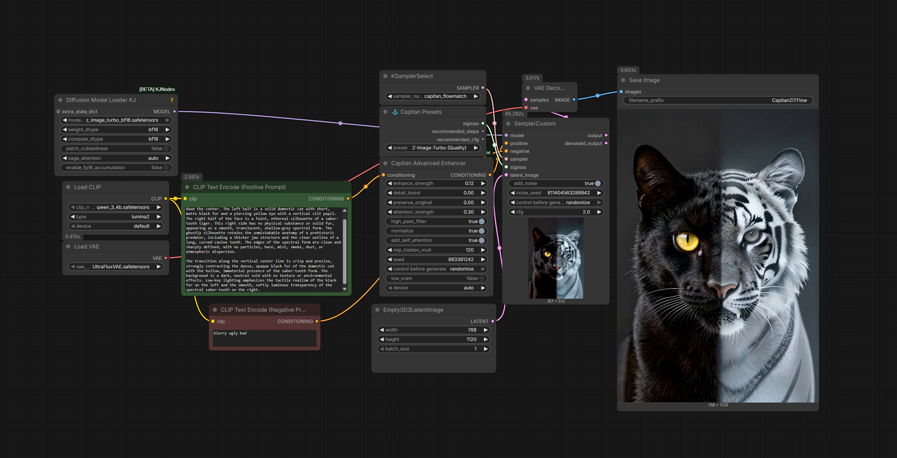
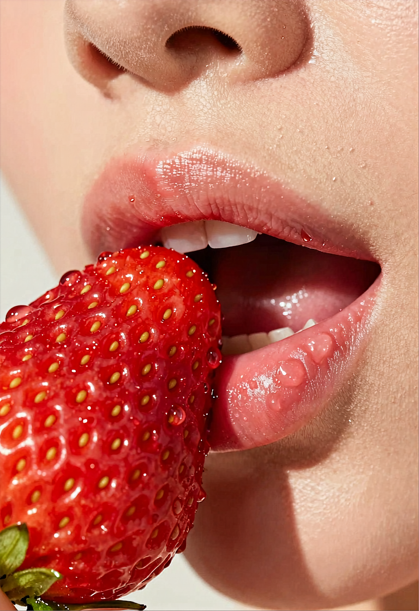
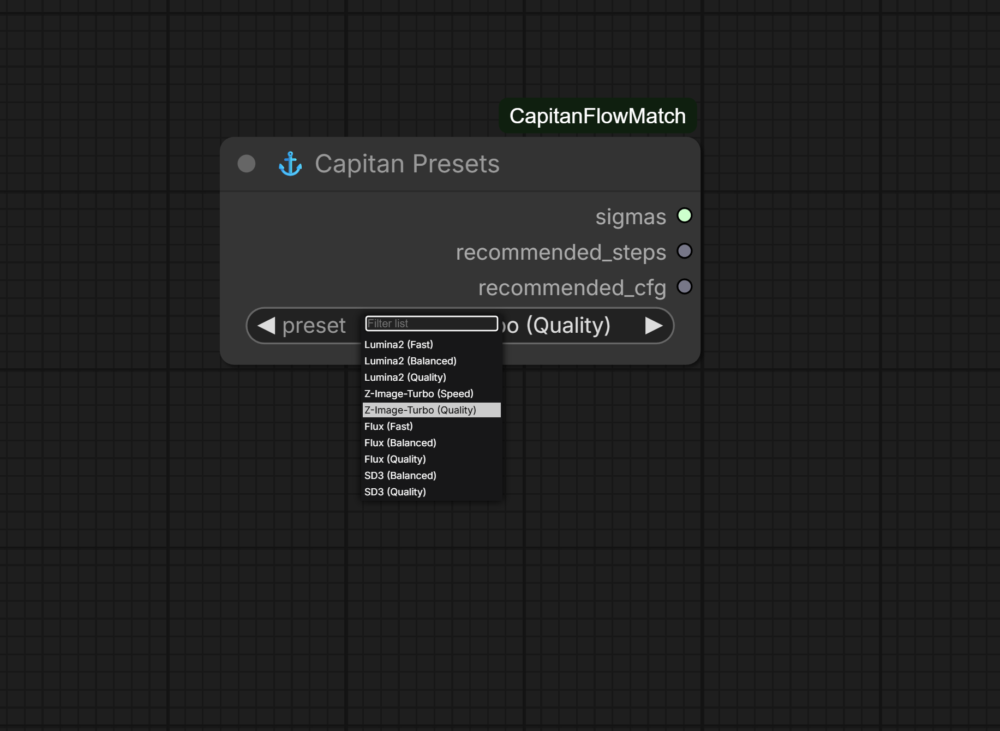
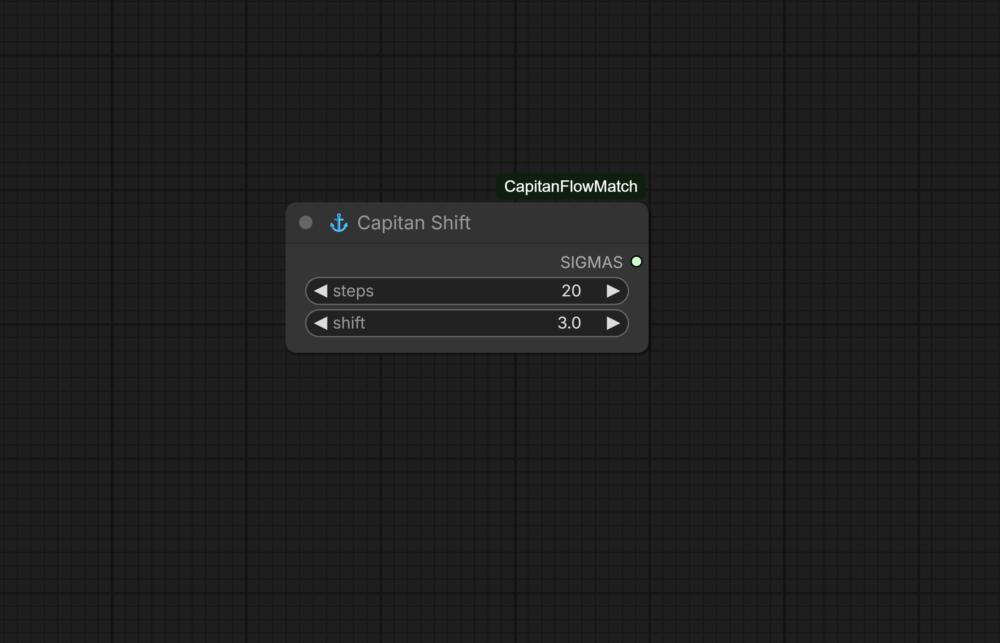
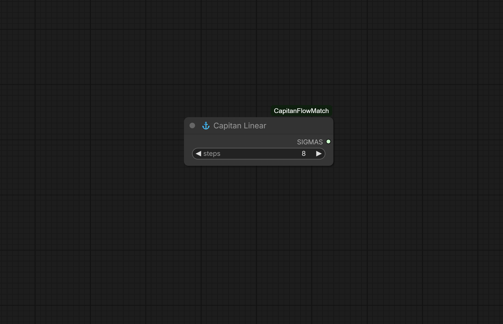
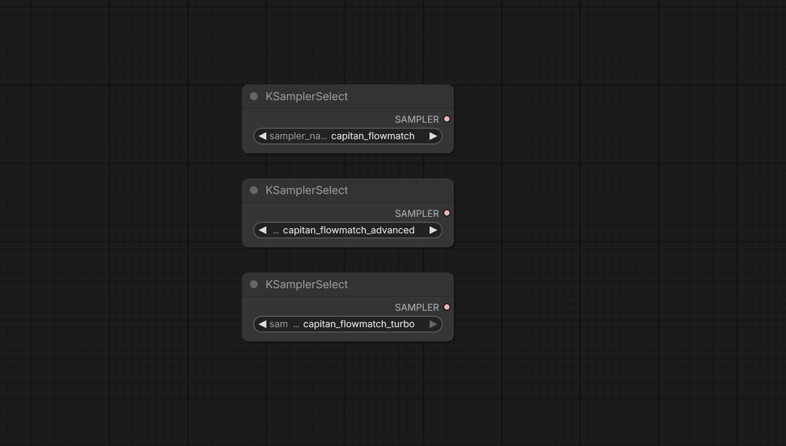

# ⚓ ComfyUI-CapitanFlowMatch

**Optimal samplers and schedulers for rectified flow models.**

Lumina2, Flux, SD3, and Z-Image use rectified flow — a fundamentally different architecture than SD1.5/SDXL. Using standard samplers leaves quality on the table.


## Generated Portraits (Z-Image-Turbo Quality Preset)

Click any thumbnail for full resolution:

<div style="display: flex; gap: 20px; flex-wrap: wrap; justify-content: center;">
  <a href="examples/CapitanZiTFlow_00006_.png">
    
  </a>
  <a href="examples/CapitanZiTFlow_00007_.png">
    
  </a>
  <a href="examples/CapitanZiTFlow_00010_.png">
    
  </a>
   <a href="examples/CapitanZiTFlow_00012_.png">
    
  </a>
</div>

## Why?

Try running Z-Image-Turbo at 36 steps and high cfg with the default euler sampler.

It burns.

Now try it with Capitan FlowMatch.

It doesn't.

**That's why.**

---

## Installation

### ComfyUI Manager

Search for `ComfyUI-CapitanFlowMatch` and install.

### Manual

```bash
cd ComfyUI/custom_nodes
git clone https://github.com/capitan01R/ComfyUI-CapitanFlowMatch.git
```

Restart ComfyUI.

---

## Nodes

### ⚓ Capitan Presets



One-click presets for all major flow models. Just select your model and quality tier.

| Model | Speed | Balanced | Quality |
|-------|-------|----------|---------|
| Lumina2 | 12 steps | 20 steps | 36 steps |
| Z-Image-Turbo | 8 steps | - | 36 steps |
| Flux | 12 steps | 20 steps | 36 steps |
| SD3 | - | 24 steps | 36 steps |

**Outputs:** `SIGMAS`, `recommended_steps`, `recommended_cfg`

### ⚓ Capitan Shift


Manual control over steps and shift value.

| Parameter | Default | Description |
|-----------|---------|-------------|
| steps | 20 | Number of sampling steps |
| shift | 3.0 | Schedule shift (higher = more steps at high noise) |

### ⚓ Capitan Linear


Simple linear schedule from 1.0 → 0.0. For models that expect unshifted schedules.

---

## Samplers


## Samplers

Three samplers are automatically registered — all carefully tuned for the best results on rectified flow models (Lumina2, Z-Image, Flux, SD3, etc.):

| Sampler                       | Description                                                                 | When to Use                                   |
|-------------------------------|-----------------------------------------------------------------------------|-----------------------------------------------|
| `capitan_flowmatch`           | The flagship sampler — delivers the sharpest, most consistent quality across all use cases | Default choice for everything, especially longer / higher-quality generations |
| `capitan_flowmatch_advanced`  | Alternate processing path — tends to produce slightly smoother, more blended results | When you prefer a gentler, less aggressive look or want to compare variations |
| `capitan_flowmatch_turbo`     | Specially hardened variant — extra safeguards against edge-case artifacts in very fast/distilled models | Best for turbo/distilled checkpoints (Z-Image-Turbo, fast Flux variants) |

Use with **SamplerCustom** or **KSampler** nodes.

---

## Recommended Settings

### Lumina2

| Quality | Sampler | Steps | Shift | CFG |
|---------|---------|-------|-------|-----|
| Fast | capitan_flowmatch | 12 | 2.0 | 2.0 |
| Balanced | capitan_flowmatch | 20 | 3.0 | 2.0 |
| Quality | capitan_flowmatch | 36 | 6.0 | 2.0 |

### Z-Image-Turbo

| Quality | Sampler | Steps | Shift | CFG |
|---------|---------|-------|-------|-----|
| Speed | capitan_flowmatch_turbo | 8 | 1.0 | 1.0 |
| **Quality** | capitan_flowmatch | **36** | **6.0** | **2.0** |

> **💡 Hidden Quality Mode:** Z-Image-Turbo at 36 steps with shift 6.0 produces exceptional results. Standard samplers burn at these settings — Capitan doesn't.

### Flux

| Quality | Sampler | Steps | Shift | CFG |
|---------|---------|-------|-------|-----|
| Fast | capitan_flowmatch | 12 | 2.0 | 3.5 |
| Balanced | capitan_flowmatch | 20 | 3.0 | 3.5 |
| Quality | capitan_flowmatch | 36 | 6.0 | 3.5 |

### SD3

| Quality | Sampler | Steps | Shift | CFG |
|---------|---------|-------|-------|-----|
| Balanced | capitan_flowmatch | 24 | 3.0 | 4.0 |
| Quality | capitan_flowmatch | 36 | 5.0 | 4.0 |

---

## Usage

### With Presets (Easiest)

1. Add **⚓ Capitan Presets** node
2. Select your model and quality tier
3. Connect `sigmas` to **SamplerCustom**
4. Select `capitan_flowmatch` as sampler
5. Done

### With Manual Control

1. Add **⚓ Capitan Shift** node
2. Set steps and shift value
3. Connect `sigmas` to **SamplerCustom**
4. Select `capitan_flowmatch` as sampler

---

## FAQ

**Q: Can't I do this with built-in nodes?**

A: Yes. You'll need ModelSamplingFlux → BasicScheduler → SamplerCustom with the correct shift value (which varies per model), correct steps (which varies per model), and knowledge of which models are rectified flow.

Or just use Capitan Presets and pick from a dropdown.

**Q: Why does Z-Image-Turbo work at 36 steps?**

A: Turbo models are *optimized* for few steps, not *limited* to them. With the correct sampler and schedule, they can utilize additional steps for quality gains. Standard samplers accumulate errors that cause burning — Capitan doesn't.

**Q: Which sampler should I use?**

A: `capitan_flowmatch` for everything. The other variants exist for edge cases and experimentation.

---

## Comparison

| Setup | Steps Needed | Quality | Burning? |
|-------|--------------|---------|----------|
| euler + karras | 30-40 | ⚠️ Suboptimal | Yes at high steps |
| euler + normal | 25-35 | ⚠️ Mediocre | Yes at high steps |
| **capitan_flowmatch + shift** | **15-25** | ✅ **Optimal** | **No** |

---

## Credits

Built for the ComfyUI community.

If this helped you, star the repo ⭐
